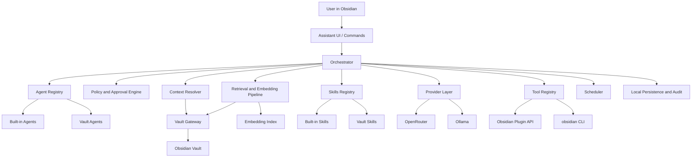
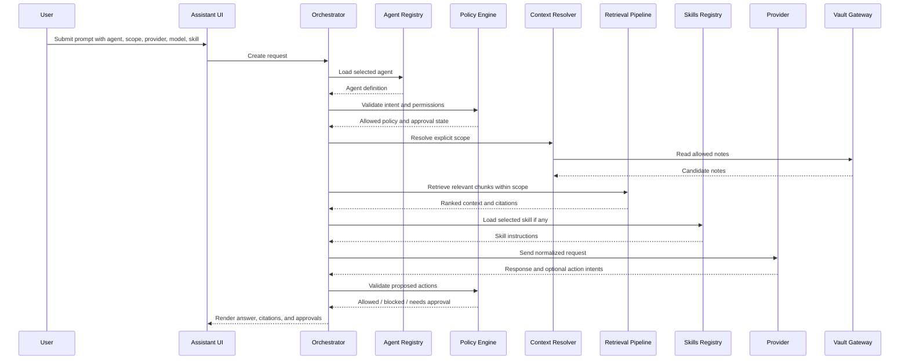
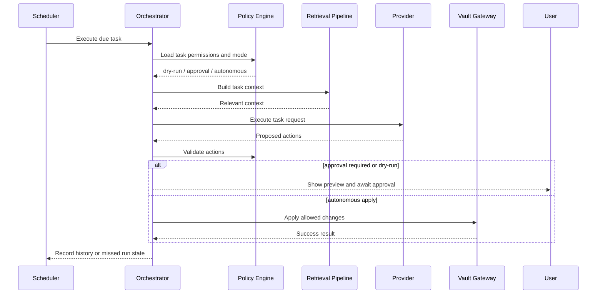

# ARCHITECTURE

## High-Level Structure

The plugin is composed of these major systems:

- Plugin Shell
- Assistant UI
- Orchestrator
- Agent Registry
- Policy and Approval Engine
- Vault Gateway
- Retrieval and Embedding Pipeline
- Provider Layer
- Skills Registry
- Tool Registry
- Scheduler
- Local Persistence and Audit

## Core Components

### 1. Plugin Shell

Responsibilities:

- plugin lifecycle
- command registration
- view registration
- settings registration
- scheduler startup
- indexing lifecycle hooks

### 2. Assistant UI

Responsibilities:

- right sidebar assistant
- conversation rendering
- agent switching
- context selection
- provider/model selection
- skill selection
- approval controls
- task creation and inspection
- logs and history views

### 3. Agent Registry

Responsibilities:

- define built-in agents
- load vault agents from `Agents/<agent-name>/AGENT.md`
- parse frontmatter
- validate agent definitions
- resolve built-in and vault override precedence
- expose agent metadata to UI and orchestrator

Initial built-in primary agents:

- `ask`
- `edit`

### 4. Orchestrator

Responsibilities:

- merge selected agent, user intent, context, skill, policy, and tool availability
- route requests to the correct execution path
- coordinate retrieval, provider calls, and tool calls
- turn model responses into user-visible actions
- enforce conversation-level execution behavior

### 5. Policy and Approval Engine

Responsibilities:

- allowed working directory enforcement
- allowed action checks
- tool permission checks
- skill permission checks
- agent permission checks
- approval state tracking
- temporary trust scopes
- destructive action protection

Approval behavior:

- edit and action proposals require approval by default
- temporary approvals may cover the current run or conversation where allowed
- delete and move actions always require explicit approval
- blocked actions return clear explanations

### 6. Vault Gateway

Responsibilities:

- read notes
- search notes
- create notes
- edit notes
- move notes
- delete notes
- inspect metadata and links
- generate and apply diffs
- enforce path boundaries

All vault access goes through this layer.

### 7. Retrieval and Embedding Pipeline

Responsibilities:

- note discovery
- chunking
- embedding generation
- index storage
- incremental re-indexing
- full rebuilds
- hybrid retrieval
- citation mapping

Design choices:

- embeddings are first-class
- retrieval happens inside the selected scope
- retrieval is hybrid within that scope:
  - semantic similarity
  - lexical boost
  - metadata-aware filtering
- both cloud and local embeddings are supported

### 8. Provider Layer

Responsibilities:

- normalize cloud and local providers
- list models
- report capabilities
- execute generation requests
- execute embedding requests
- normalize errors and timeouts

Initial providers:

- `OpenRouter`
- `Ollama`

Provider metadata should expose:

- provider id
- model id
- display name
- local or cloud
- generation support
- embedding support
- streaming support
- tool-calling support
- structured output support
- context size
- recommended uses

### 9. Skills Registry

Responsibilities:

- load built-in skills
- load vault skills from `Skills/<skill-name>/SKILL.md`
- parse frontmatter
- validate metadata
- expose skills to chat and tasks
- resolve override precedence

Rule:

- vault skills override built-in skills with the same identifier

### 10. Tool Registry

Responsibilities:

- register built-in tools
- register tool adapters
- expose tool schemas
- enforce tool permissions
- execute tool calls
- log tool use
- route tools through the chosen backend

Initial primitive tool families:

- active note and selection tools
- note read and search tools
- note create and update tools
- frontmatter tools

Backend options:

- Obsidian Plugin API
- `obsidian CLI`
- future backend adapters where useful

### 11. Scheduler

Responsibilities:

- store scheduled tasks
- evaluate due runs while Obsidian is open
- execute task pipelines
- record task history
- record missed runs
- optionally perform catch-up runs if configured

### 12. Local Persistence and Audit

Responsibilities:

- plugin settings
- provider settings
- model defaults
- task definitions
- task history
- conversation metadata
- approval state where needed
- audit logs
- local retrieval index metadata

## Architecture Diagram

## Chat Request Sequence

## Scheduled Task Sequence

## Retrieval Pipeline

### Indexing

- detect note creation, update, rename, and deletion
- chunk notes into retrieval units
- generate embeddings
- store chunk-to-note mapping
- update index incrementally
- support full rebuild command

### Retrieval

- start from explicit user scope
- fetch candidate chunks from that scope
- rank semantically
- apply lexical boost where useful
- apply metadata constraints where relevant
- return citations mapped to notes and source chunks

## Security Model

Boundaries:

- all file operations go through `Vault Gateway`
- all permissions go through `Policy and Approval Engine`
- all model interactions go through `Provider Layer`
- all tool calls go through `Tool Registry`
- tool backends may use the Obsidian Plugin API or `obsidian CLI`

Trust rules:

- no write outside allowed working directory
- delete and move always require explicit approval
- temporary approvals never bypass destructive safeguards

## Storage Model

Persist locally:

- settings
- provider configs
- model defaults
- skills index metadata
- retrieval index metadata
- task definitions
- task history
- conversation metadata
- audit logs
